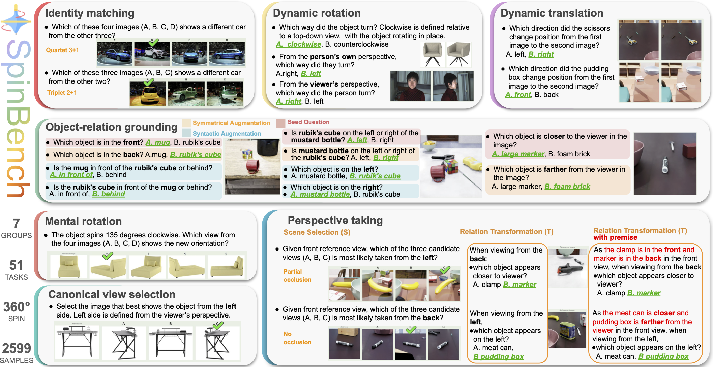

<div align="center">
  <h1> SpinBench: Perspective and Rotation as a Lens on Spatial Reasoning in VLMs </h1>
</div>

<h5 align="center">
  <a href="https://spinbench25.github.io/">🌐 Website</a> |
  <a href="https://huggingface.co/datasets/YuyouZhang/SpinBench">🤗 Dataset</a> |
  <a href="https://arxiv.org/abs/2509.25390">📑 Paper</a> |
  <a href="https://github.com/ZhangYuyou-10/SpinBench">💻 Code</a>
</h5>


This repo contains evaluation code for the paper "SpinBench: Perspective and Rotation as a Lens on Spatial Reasoning in VLMs"
<!-- [Project page](https://spinbench25.github.io/) • [arXiv:2509.25390](https://arxiv.org/abs/2509.25390) -->

---
## Introduction

 **SpinBench** is a cognitively grounded diagnostic benchmark for evaluating spatial reasoning in vision language models (VLMs). 
 SpinBench is designed around the core challenge of spatial reasoning: perspective taking, the ability to reason about how **scenes** and **object relations** change under **viewpoint transformation**. 
 
 Since perspective taking requires multiple cognitive capabilities, such as recognizing objects across views, relative positions grounding, and mentally simulating transformations, SpinBench introduces a set of fine-grained diagnostic categories. Our categories target **translation**, **rotation**, **object relative pose**, and **viewpoint change**, and are progressively structured so that **single-object** simpler tasks scaffold toward the most demanding **multi-object** perspective-taking setting.
 
 We evaluate 37 state-of-the-art VLMs, both proprietary and open source. Results reveal systematic weaknesses: **strong egocentric bias, poor rotational understanding, and inconsistencies under symmetrical and syntactic reformulations**. Scaling analysis shows both smooth improvements and emergent capabilities. 
 
 <!-- While human subjects achieve high accuracy (91.2%), task difficulty as measured by human response time shows strong correlation with VLM accuracy, indicating that SpinBench captures spatial reasoning challenges shared across humans and VLMs.  -->

## 🚀 Setup: Evaluation Environment

To set up the evaluation environment, follow these steps:

### 1. Conda environemnt

We recommend using conda environemnt:

```bash
conda create -n spinbench python=3.11
conda activate spinbench
```

---


### 2. Install PyTorch with CUDA 

```bash
pip install torch==2.6.0 torchvision==0.21.0 torchaudio==2.6.0 --index-url https://download.pytorch.org/whl/cu124
```

---

### 3. Install FlashAttention

```bash
pip install flash-attn==2.7.4.post1 --no-build-isolation
```
### 4. Clone this repo
```shell
git clone https://github.com/ZhangYuyou-10/SpinBench.git
```

---

### 5. Install other dependencies

Install the remaining packages using the provided requirements file:

```bash
pip install -r requirements.txt
pip install lmdeploy
```

---

## 📊 Running Evaluations

### 🤗 Download the dataset
Download the data from [🤗 Dataset](https://huggingface.co/datasets/YuyouZhang/SpinBench).

<details>
<summary><strong>Click to expand folder structure</strong></summary>

&nbsp;

```bash
SpinBench/
├── eval/                       # Evaluation scripts and model interfaces
├── data/                       # Dataset and image assets
│   ├── test.jsonl              # Full benchmark JSONL
│   ├── test_small.jsonl        # Subset for quick testing
│   └── images/                 # image folder 
│       ├── cars_rotation_c187650a7b.jpg
│       ├── face_rotation_2b4fd309cf.png
│       ├── infinigen_d3f202e7a1.png
│       ├── original_01bce239aa.jpg
│       └── ...
├── requirements.txt            # dependencies
├── README.md                   
└── ...
```

</details>

### Evaluate proprietary models

To evaluate proprietary models like GPT and Claude, run:

```bash
python eval/proprietary_evaluator.py --test_file "data/test.jsonl" --base_image_path "data" --model_name gpt-4o
python eval/proprietary_evaluator.py --test_file "data/test.jsonl" --base_image_path "data" --model_name claude-sonnet-4-20250514
```

Make sure necessary API keys are configured via environment variables or args.

---

### Evaluate open-source models

To evaluate open-source models supported by [LMDeploy](https://github.com/InternLM/lmdeploy), run:


```bash
python eval/run_benchmark.py --model_path 'OpenGVLab/InternVL3-1B' --tp 1 --test_file "data/test.jsonl" --output_dir "results"

python eval/run_benchmark.py --model_path 'OpenGVLab/InternVL3-38B' --tp 4 --test_file "data/test.jsonl" --output_dir "results"
```

or submit multiple evaluations jobs
```bash
python eval/submit_benchmark.py --models 'OpenGVLab/InternVL3-1B' 'OpenGVLab/InternVL3-2B' 'OpenGVLab/InternVL3-8B' 'OpenGVLab/InternVL3-9B'
```
Or list models
```bash
python eval/submit_benchmark.py --list-models
```
"submit_benchmark.py" will use the configurations defined in :

```
eval/model_config.py
```
Update this file to add or modify model settings for evaluation.

For other models, run
```bash
python eval/run_cosmos.py --test_file "data/test.jsonl" --output_dir "./results" --base_image_dir "data" --model_path "nvidia/Cosmos-Reason1-7B" --use_system_prompt
python eval/run_llavaone.py --test_file "data/test.jsonl" --output_dir "./results" --base_image_dir "data"  --model_path "llava-hf/llava-onevision-qwen2-7b-ov-hf" 
python eval/run_spaceom.py --test_file "data/test.jsonl" --output_dir "./results" --base_image_dir "data"  --model_path "remyxai/SpaceOm"

```

## Citation

**BibTeX:**
```bibtex
@article{zhang2025spinbench,
  title={SpinBench: Perspective and Rotation as a Lens on Spatial Reasoning in VLMs},
  author={Zhang, Yuyou and Corcodel, Radu and Hori, Chiori and Cherian, Anoop and Zhao, Ding},
  journal={arXiv preprint arXiv:2509.25390},
  year={2025}
}
```


